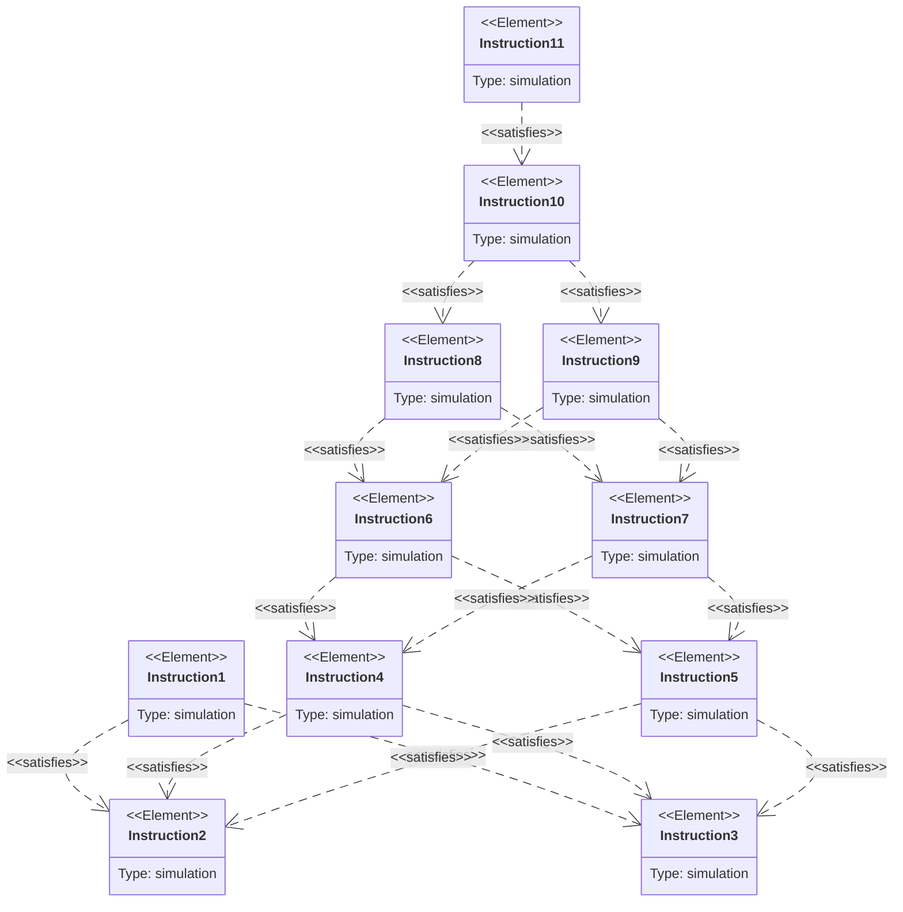
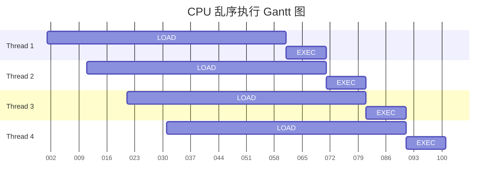

[toc]

# [Write Assignment 1](https://gfxcourses.stanford.edu/cs149/fall21content/static/pdfs/written_asst1.pdf)

## Problem 1: Superscalar and Hardware Multi-Threading
### A. Instruction Dependency

 1. LD R1 <- [R0]
 2. MUL R2 <- R1, R1
 3. ADD R3 <- R1, R1
 4. MUL R4 <- R2, R3
 5. ADD R5 <- R2, R3
 6. MUL R2 <- R4, R5
 7. ADD R3 <- R4, R5
 8. MUL R4 <- R2, R3
 9. ADD R5 <- R2, R3
 10. ADD R1 <- R4, R5
 11. ST [R0] <- R1  

 Please draw the dependency graph for the instruction sequence.

### B. steay-state utilization of the processor
10 / 70 = 14.28%

### C. total hardware threads are needed
70 / 10 = 7 threads

### D. speedup of for-way superscalar proceessor

（70 + 60 + 50 + 40 ）/ 70 = 3.1428571429
## Problem 2: Picking the Right CPU for the Job